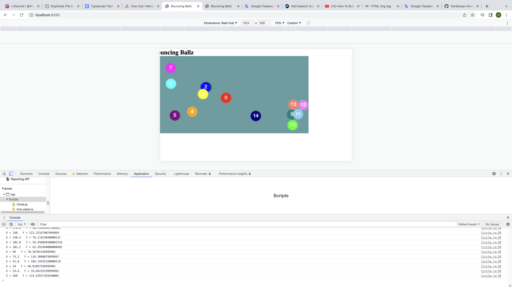

# New Project

> ✨ Bootstrapped with Create Snowpack App (CSA).

## Available Scripts

### 
<h1></h1>

<h2>for run app </h2>

npm install

npm run start

<d/>
<h2>for create new app </h2>

    
for avoid dis error i use <q>Snowpack</q>

    
Uncaught ReferenceError: exports is not defined at <b>index.js</b>

<h4>i use this source</h4>

    
https://www.youtube.com/watch?v=jBmrduvKl5w

    
npx create-snowpack-app . --template @snowpack/app-template-blank-typescript --force

    
open and learn

    
https://www.w3schools.com/graphics/canvas_coordinates.asp

    
https://www.tutorialspoint.com/typescript/typescript_arrays.htm

    <h5>Mmdn web docs</h5>
    
https://developer.mozilla.org/en-US/docs/Web/API/Element/getBoundingClientRect

